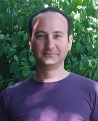

```{r setup, include=F}
knitr::opts_chunk$set(echo = F)
```

<br>
<br>



<div>
I am a data scientist and a political psychologist specializing in psychometrics, psycholinguistics, cross-cultural research, and modeling subjectivity with 7+ years of 
```{r}
icons::fontawesome$brands$`r-project`
```
and 2+ years of 
```{r}
icons::fontawesome$brands$python
```
experience.
</div>

<div>
As a political psychologist[^1], my passion is revealing and understanding heterogeneity. That translates into various unsupervised machine learning and natural language processing applications.
</div>

<div>
To get to know me as the data scientist, you can look at what I do on [
```{r}
icons::fontawesome$brands$github
```
](https://github.com/mmuratardag){target="_blank"} or see my [
```{r}
icons::fontawesome$brands$linkedin
```
](https://www.linkedin.com/in/mmuratardag){target="_blank"} profile.
</div>

<div>
To find out more about me as the political psychologist, visit my [academic website](https://mmuratardag.github.io/academic_website).
</div>

<div>
I occasionally make blogposts; read them [here](https://mmuratardag.github.io/blog_posts).
</div>

[^1]: In case, you are wondering what political psychology is [this](https://pprg.stanford.edu/what-is-political-psychology){target="_blank"}, [this](https://en.wikipedia.org/wiki/Political_psychology){target="_blank"} & [this](https://ispp.org){target="_blank"} can help form an accurate impression.